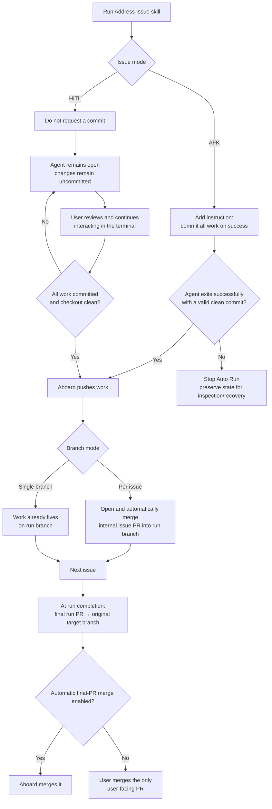

```mermaid
flowchart TD
    A["Run Address Issue skill"] --> B{"Issue mode"}

    B -->|AFK| C["Add instruction:<br/>commit all work on success"]
    C --> D{"Agent exits successfully<br/>with a valid clean commit?"}
    D -->|Yes| E["Aboard pushes work"]
    D -->|No| X["Stop Auto Run<br/>preserve state for inspection/recovery"]

    B -->|HITL| F["Do not request a commit"]
    F --> G["Agent remains open<br/>changes remain uncommitted"]
    G --> H["User reviews and continues<br/>interacting in the terminal"]
    H --> I{"All work committed<br/>and checkout clean?"}
    I -->|No| G
    I -->|Yes| E

    E --> J{"Branch mode"}
    J -->|Per issue| K["Open and automatically merge<br/>internal issue PR into run branch"]
    J -->|Single branch| L["Work already lives<br/>on run branch"]

    K --> M["Next issue"]
    L --> M

    M --> N["At run completion:<br/>final run PR → original target branch"]
    N --> O{"Automatic final-PR merge enabled?"}
    O -->|Yes| P["Aboard merges it"]
    O -->|No| Q["User merges the only<br/>user-facing PR"]
```
